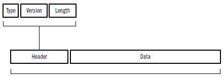
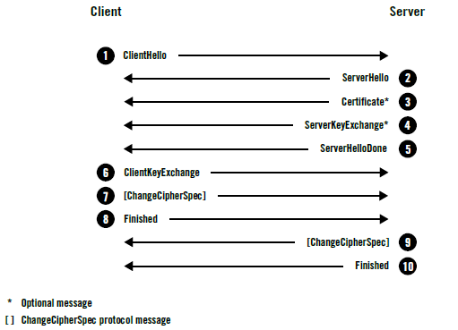
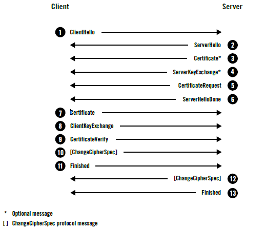
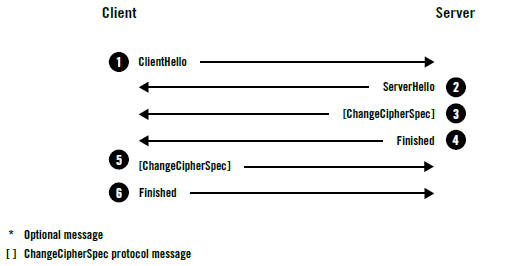
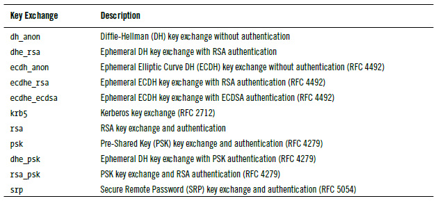
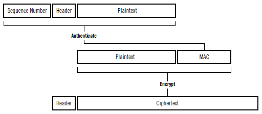
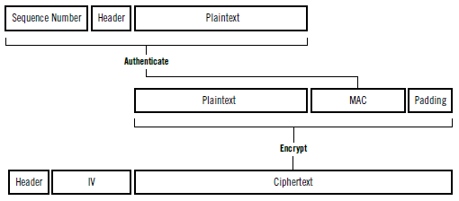
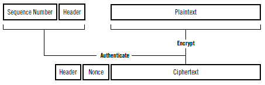

# 协议

## 记录协议 \(Record Protocol\)

* 记录协议负责在传输连接上交换的所有**底层**消息，并可以配置**加密**。
* 每一条TLS记录以一个短标头起始。**标头**包含记录内容的**类型**（或子协议）、协议**版本**和**长度**。
* **消息数据**紧跟在标头之后。



```c
struct {
    uint8 major;
    uint8 minor;
} ProtocolVersion;

enum {
    change_cipher_spec (20), /* 密钥规格变更协议 */
    alert (21), /* 警报协议 */
    handshake (22), /* 握手协议 */
    application_data (23) /* 应用数据协议 */
} ContentType;

struct {
    ContentType type;
    ProtocolVersion version;
    uint16 length; /* 最大长度为2^14（16,384）字节 */
    opaque fragment[TLSPlaintext.length];
} TLSPlaintext;
```

* 除了可见的字段，每一个TLS记录都会被指定唯一的64为**序列号**，但不会在线路上传输。
* 任一端都有自身的**序列号**并跟踪来自另一端记录的数量。（对抗重放攻击）

### 子协议 \(Subprotocols\)

* 握手协议 \(Handshake Protocol\)
* 密钥规格变更协议 \(Change Cipher Spec Protocol\)
* 应用数据协议 \(Application Data Protocol\)
* 警报协议 \(Alert Protocol\)

## 握手协议 \(Handshake Protocol\)

1. 完整的握手，对服务器进行身份验证。
2. 客户端身份验证，对客户端和服务器都进行身份验证。
3. 会话恢复，恢复之前会话采用的简短握手。

```c
struct {
    HandshakeType msg_type;
    uint24 length;
    HandshakeMessage message;
} Handshake;
```

* 握手协议消息的**标头**信息包含消息**类型**（1字节）和**长度**（3字节），余下的信息则取决于消息类型。

### 完整的握手 \(Full Handshake\)

每一个TLS连接都会以握手开始。主要步骤如下：

1. 交换各自支持的功能，对需要的连接参数达成一致。
2. 验证出示的证书，或使用其他方式进行身份验证。
3. 对将用于保护会话的共享主密钥达成一致。
4. 验证握手消息并未被第三方团体修改。



1. 客户端开始新的握手，并将自身支持的功能提交给服务器。
2. 服务器选择连接参数。
3. 服务器发送其证书链（仅当需要服务器身份验证时）。
4. 根据选择的密钥交换方式，服务器发送生成主密钥的额外信息。
5. 服务器通知自己完成了协商过程。
6. 客户端发送生成主密钥所需的额外信息。
7. 客户端切换加密方式并通知服务器。
8. 客户端计算发送和接收到的握手消息的MAC并发送。
9. 服务器切换加密方式并通知客户端。
10. 服务器计算发送和接收到的握手消息的MAC并发送。

#### ClientHello

* 将客户端的**功能**和**首选项**传送给服务器。
* Version：协议版本指示客户端支持的最佳协议版本。
* Random：随机数字段包含**32字节**的数据。在握手时，客户端和服务器都会提供随机数。这种随机性对每次握手都是独一无二的，在**身份验证**中起着举足轻重的作用。它可以**防止重放攻击**，并确认初始数据交换的**完整性**。
* Session ID：会话ID字段包含**32字节**随机生成的数据，保存着会话的**唯一标识**。第一次连接时为**空**，表示不希望恢复某个已存在的会话。**服务器**可以借助会话ID在自己的**缓存**中找到对应的会话状态。
* Cipher Suites：密码套件块按**优先级**顺序排列客户端支持的所有密码套件。
* Compression：客户端可以提交一个或多个支持压缩的方法。**默认**的压缩方法是**null**，代表没有压缩。
* Extensions：扩展块由任意数量的扩展组成。这些扩展会携带**额外数据**。

```yaml
Handshake protocol: ClientHello
    Version: TLS 1.2
    Random
        Client time: May 22, 2030 02:43:46 GMT
        Random bytes: b76b0e61829557eb4c611adfd2d36eb232dc1332fe29802e321ee871
    Session ID: (empty)
    Cipher Suites
        Suite: TLS_ECDHE_RSA_WITH_AES_128_GCM_SHA256
        Suite: TLS_DHE_RSA_WITH_AES_128_GCM_SHA256
        Suite: TLS_RSA_WITH_AES_128_GCM_SHA256
        Suite: TLS_ECDHE_RSA_WITH_AES_128_CBC_SHA
        Suite: TLS_DHE_RSA_WITH_AES_128_CBC_SHA
        Suite: TLS_RSA_WITH_AES_128_CBC_SHA
        Suite: TLS_RSA_WITH_3DES_EDE_CBC_SHA
        Suite: TLS_RSA_WITH_RC4_128_SHA
    Compression methods
        Method: null
    Extensions
        Extension: server_name
            Hostname: www.feistyduck.com
        Extension: renegotiation_info
        Extension: elliptic_curves
            Named curve: secp256r1
            Named curve: secp384r1
        Extension: signature_algorithms
            Algorithm: sha1/rsa
            Algorithm: sha256/rsa
            Algorithm: sha1/ecdsa
            Algorithm: sha256/ecdsa
```

#### ServerHello

* 将服务器**选择的连接参数**传回客户端。每个字段只包含**一个**选项。
* 服务器**无需**支持客户端支持的最佳版本。可以提供某个其他版本以期待客户端能够接受。

```yaml
Handshake protocol: ServerHello
    Version: TLS 1.2
    Random
        Server time: Mar 10, 2059 02:35:57 GMT
        Random bytes: 8469b09b480c1978182ce1b59290487609f41132312ca22aacaf5012
    Session ID: 4cae75c91cf5adf55f93c9fb5dd36d19903b1182029af3d527b7a42ef1c32c80
    Cipher Suite: TLS_ECDHE_RSA_WITH_AES_128_GCM_SHA256
    Compression method: null
    Extensions
        Extension: server_name
        Extension: renegotiation_info
```

#### Certificate

* 典型的Certificate消息用于携带服务器**X.509证书链**。参考链接：[\[1\]](https://www.ssl.com/zh-CN/%E5%B8%B8%E8%A7%81%E9%97%AE%E9%A2%98/%E4%BB%80%E4%B9%88%E6%98%AFx-509%E8%AF%81%E4%B9%A6/) [\[2\]](https://www.ssl.com/faqs/what-is-an-x-509-certificate/) 。
* 服务器必须保证它发送的**证书**与选择的**算法**套件**一致**。
* 一些密钥交换算法**依赖**嵌入证书的特定数据，而且**要求**证书必须以客户端支持的算法签名。
* Certificate消息是**可选**的，因为并非所有套件都使用身份验证，也并非所有身份验证方法都需要证书。

#### ServerKeyExchange

* 携带**密钥交换**的额外数据。
* 消息内容对于不同的**协商算法套件**都会存在**差异**。在某些场景中，服务器不需要发送任何内容。

#### ServerHelloDone

* 表明服务器已经将所有预计的握手消息发送完毕。

#### ClientKeyExchange

* 携带客户端为**密钥交换**提供的所有信息。
* 消息内容随着不同的**协商密码套件**而**不同**。

#### ChangeCipherSpec

* 表明发送端已取得用以生成连接参数的足够信息，**已生成加密密钥**，并且将**切换到加密模式**。
* ChangeCipherSpec**不属于**握手消息，它是另一种协议，只有一条消息，作为它的**子协议**进行实现。

#### Finished

* 表示握手已经**完成**，消息内容将加密，以便双方可以安全地交换验证整个握手完整性所需的数据。
* 在TLS 1.2版本中，Finished消息的长度默认是**12字节**（96位），并且允许密码套件使用更长的长度。
* 这个消息包含**verify\_data字段**，它的值是握手过程中所有消息的散列值。
* 连接的两端都按照**各自所见的顺序**排列所有消息，并以协商新得到的**主密钥**计算散列。这个过程是通过一个伪随机函数 \(pseudorandom function, **PRF\)** 来完成的。两端会使用**不同的标签**：客户端使用client finished，服务器使用server finished。
* verify\_data = PRF\(master\_secret, finished\_label, Hash\(handshake\_messages\)\)
* Finished消息是**加密**的，并且它们的**完整性**由协商MAC算法保证。

### 客户端身份认证 \(Client Authentication\)

1. 服务器通过发送CertificateRequest消息请求对客户端进行身份验证。消息中列出所有可接受的客户端证书。
2. 客户端发送自己的Certificate消息（使用与服务器发送证书相同的格式），并附上证书。
3. 客户端发送CertificateVerify消息，证明自己拥有对应的私钥。



#### CertificateRequest

* 将服务器可接受的证书的**类型**、**公钥和签名算法**及**证书颁发机构列表**传送给客户端。

```c
struct {
    ClientCertificateType certificate_types;
    SignatureAndHashAlgorithm supported_signature_algorithms;
    DistinguishedName certificate_authorities;
} CertificateRequest;
```

#### CertificateVerify

* **证明**自己拥有的**私钥**与之前发送的客户端证书中的**公钥**相**对应**。
* 消息中包含一条到这一步为止的所有握手消息的**签名**。

```c
struct {
    Signature handshake_messages_signature;
} CertificateVerify;
```

### 会话恢复 \(Session Resumption\)

在一次完整协商的连接断开时，客户端和服务器都会将会话的安全参数保存一段时间。通过简短握手的方式恢复会话可以节约消耗。

1. 客户端将希望恢复的先前会话ID放入ClientHello消息中。
2. 服务器如果愿意恢复会话，则在ServerHello消息中将会话ID发回客户端。
3. 接着使用之前协商的主密钥生成一套新的密钥，再切换到加密模式，发送Finished消息。



* 用来替代服务器会话缓存和恢复的方案是使用会话票证 \(sesession ticket\)。

## 密钥交换 \(Key Exchange\)

* 目的：计算预主密钥 \(**premaster secret**\) ，这个值是组成**48字节**主密钥 \(**master secret**\) 的来源。
* 常用密钥交换算法：RSA、DHE\_RSA、ECDHE\_RSA 和 ECDHE\_ECDSA。



```c
struct {
    select (KeyExchangeAlgorithm) {
        case dh_anon:
            ServerDHParams params;
        case dhe_rsa:
            ServerDHParams params;
            Signature params_signature;
        case ecdh_anon:
            ServerECDHParams params;
        case ecdhe_rsa:
        case ecdhe_ecdsa:
            ServerECDHParams params;
            Signature params_signature;
        case rsa:
        case dh_rsa:
            /* no message */
    };
} ServerKeyExchange;
```

```c
struct {
    select (KeyExchangeAlgorithm) {
        case rsa:
            EncryptedPreMasterSecret;
        case dhe_dss:
        case dhe_rsa:
        case dh_dss:
        case dh_rsa:
        case dh_anon:
            ClientDiffieHellmanPublic;
        case ecdhe:
            ClientECDiffieHellmanPublic;
    } exchange_keys;
} ClientKeyExchange;
```

### RSA 密钥交换

* 客户端生成**预主密钥**（**46字节**随机数），使用服务器**公钥**对其加密，将其包含在**ClientKeyExchange**消息中，最后发送出去。服务器只需要解密这条消息就能取出预主密钥。
* 不支持前向保密 \(**forward secrecy**\) 。只要密钥泄露， 就可以解密之前记录的所有流量。

### Diffie-Hellman 密钥交换

* 目的：在不安全的信道上生成共享密钥。
* 参数：域参数 **dh\_p** 和 **dh\_g**，由服务器选取。客户端和服务器各自生成另外两个参数，并相互发送其中一个参数 **dh\_Ys** 和 **dh\_Yc** 到对端。总共6个参数。
* DH密钥交换的安全性取决于DH参数的质量和**强度**。
* DH密钥交换不会受到被动攻击的威胁，但主动攻击者却可以劫持通信信道，冒充对端，因此通常与**RSA身份验证**联合使用。
* 一些DH密钥交换方式中，某些参数是**静态**的，并被嵌入到服务器和客户端的证书中，导致密钥交换的结果是一直**不变**的共享密钥。
* 临时Diffie-Hellman \(ephemeral Diffie-Hellman, **DHE**\) 密钥交换中没有任何参数被重复使用。DHE支持前向保密 \(**forward secrecy**\) ，但执行相对缓慢。

```c
struct {
    opaque dh_p;
    opaque dh_g;
    opaque dh_Ys;
} ServerDHParams;
```

```c
struct {
    select (PublicValueEncoding) {
        case implicit:
            /* empty; used when the client's public parameter is embedded in its certificate */
        case explicit:
            opaque dh_Yc;
    } dh_public;
} ClientDiffieHellmanPublic;
```

### 椭圆曲线 Diffie-Hellman 密钥交换

* 椭圆曲线Diffie-Hellman \(elliptic curve Diffie-Hellman, **ECDH**\) 密钥交换原理与DH相似，但使用不同的数学基础，它基于椭圆曲线 \(elliptic curve, **EC**\) 加密。一般只使用临时的变种 \(**ECDHE**\) 。
* 服务器可以指定任意一条椭圆曲线 ，不过在TLS中，服务器通过指定某个名称引用一条可能预先定义好参数的曲线 \(**named curve**\) ，然后和公开参数 \(**EC point**\)一并提交发送给客户端。
* 客户端提交发送自己的公开参数后，就可以开始计算预主密钥。
* 与DHE类似存在主动攻击问题，在TLS中，ECDHE通常与**RSA**或者**ECDSA身份验证**一起使用。

```c
struct {
    ECCurveType curve_type;
    select (curve_type) {
        case explicit_prime:
            /* omitted for clarity */
        case explicit_char2:
            /* omitted for clarity */
        case named_curve:
            NamedCurve namedcurve;
    };
} ECParameters;

struct {
    ECParameters curve_params;
    ECPoint public;
} ServerECDHParams;
```

```c
struct {
    select (PublicValueEncoding) {
        case implicit:
            /* empty */
        case explicit:
            ECPoint ecdh_Yc;
    } ecdh_public;
} ClientECDiffieHellmanPublic;
```

* 使用**预定义参数**，以及**ellipic\_curve扩展**（客户端可以提交支持的曲线），可以使服务器选择一条双方都支持的曲线。

## 身份验证 \(Authentication\)

* 大多数场景中，身份验证的**基础**是证书支持的**公钥**密码（最常见的是RSA，有时也用ECDSA）。
* 在**RSA密钥交换**过程中，只有拥有对应**私钥**的服务器才能**解密**取得预主密钥，构造正确的会话密钥，并生成正确的Finished消息。
* 在**DHE和ECDHE的密钥交换**过程中，服务器为密钥交换提供自己的参数，并使用自己的**私钥签名**。客户端持有对应的**公钥**（从已验证的证书中获得），可以**验证**参数是否真正出自期望的服务器。

## 加密 \(Encryption\)

* 目前使用最为广泛的加密算法是**AES**。
* TLS支持三种加密类型：序列加密、分组加密和认证加密。

### 序列加密 \(Stream Encryption\)

1. 计算**MAC**值，范围包含记录序列号、标头、明文。
2. **加密**明文和MAC，生成密文。



### 分组加密 \(Block Encryption\)

1. 计算序列号、标头和明文的**MAC**。
2. 构造**填充**，确认加密前的数据长度是分组大小（通常16字节）的整数倍。
3. 生成一个长度与分组大小一致的不可预期的初始向量 \(**initialization vector, IV**\) 。IV能保证加密是不确定的。
4. 使用**CBC分组模式**加密明文、MAC和填充。
5. 将IV和密文一起发送。



* 以上处理方式被称为先计算MAC，再加密 \(**MAC-then-encrypt**\) ，而它也是很多问题的源头，比如 padding oracle attack 。
* 替代处理方式被称为先加密，再计算MAC \(**encrypt-then-MAC**\) ，可以保证主动网络攻击者不能操纵任何加密数据。

### 认证加密 \(Authenticated Encryption with Associated Data, AEAD\)

1. 生成一个唯一的**64位nonce**。
2. 使用**认证加密算法**加密明文；同时也将序列号和记录标头作为完整性验证依据的**额外数据**交给算法。
3. 将nonce和密文一起发送。



* 不用填充，不用初始向量。
* 特殊值nonce唯一且仅使用一次。
* 认证加密被认为是当前TLS中可用的加密模式中**最好**的一种，避免了MAC-then-encrypt方式带来的问题。
* TLS中相关认证加密套件：**GCM**、ChaCha20、CCM。

## 重新协商

## 应用数据协议

## 警报协议

## 关闭连接

## 密码操作

## 密码套件

## 扩展

## 协议限制

## 协议版本之间的差异

