# KNX Basics

## Introducing bus systems

* The key to making a building “intelligent” is to equip it with networked **sensors** and **actuators**. 
* **Conventional methods**: to employ a **star topology** where every node is linked by its own cable to a **central** distribution board in which the **logical relationships** are held. \(However, the system is constrained by the size of the power distribution board and it is also time-consuming to extend.\)
* **Bus technology**: to link all sensors and actuators in the building with a “data cable”, and enable them to share information with each other. 

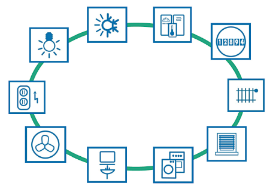

### Why KNX?

* All **strong brands** in the building installation sector are pushing KNX technology.
* Because the technology is **standardised**, KNX products are all mutually **compatible** and KNX installations can be **easily modified or extended** at a later stage.
* KNX supports all communication media: **TP** \(Twisted Pair\), **PL** \(Powerline\), **RF** \(Radio Frequency\), and **IP\(**Ethernet\).
* In situations where the customer wants a **large** number of different functions, a bus system will be **easier**, **cheaper** and **less complex** than an equivalent conventional installation.

## The KNX bus system

* All devices in a KNX system use the **same transmission method** and are able to exchange data via a **common bus network**.
* **Decentralised structure**: no central control unit. 
  * If one device fails, the others continue to function.
  * KNX bus systems can be modified and added to exactly as required.
* KNX devices
  * **System devices**: power supply, programming interface, etc.
  * **Sensors** detect events in the building, issue commands, convert these into telegrams, and send them along the bus network.
  * **Actuators** receive telegrams, convert the commands embedded in them in to actions.
* Communication media
  * **KNX Twisted Pair \(KNX TP\)**: communication via a twisted pair data cable \(bus cable\).
  * **KNX Powerline \(KNX PL\)**: uses the existing 230 V mains network.
  * **KNX Radio Frequency \(KNX RF\)**: communication via radio signal.
  * **KNX IP**: communication via Ethernet.

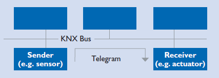

## KNX communication media

### KNX Twisted Pair \(TP\)

* A two-core twisted pair data cable \(bus cable\) is **the most common** communication medium for KNX installations.
* In KNX TP the bus cable supplies all bus devices with both **data** and **power**.

#### Telegram structure

* **Control field**: defines the **priority** of the telegram and whether or not transmission of the telegram was **repeated** \(if the receiver did not respond\). 
* **Address field**: specifies the Individual Address of the **sender** and the destination address \(Individual Address or Group Address\) of the **receiver**. 
* **Data field**: contains the telegram’s **payload** which can be up to 16 bytes long.
* **Checksum field**: is used for **parity checks**.

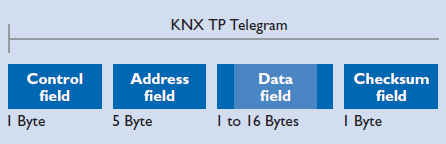

#### Bus access method

* A telegram can only be transmitted if no other telegram is being transmitted at the same time.
* To **prevent collisions** during transmission, the priorities of the various sending devices are regulated.
* The device sending the 1 “hears” that a 0 is being transmitted along the bus, and **detects** the collision. It is obliged to **abort** its own data transmission and give priority to the other transmission. After the transmission taking priority is complete, the aborted data transmission **recommences**.
* A telegram’s **level of priority** can be defined in its control field.
* If two telegrams have the same level of priority, which telegram is allowed to be sent first is determined by its **physical address** \(**0 has priority over 1**\).

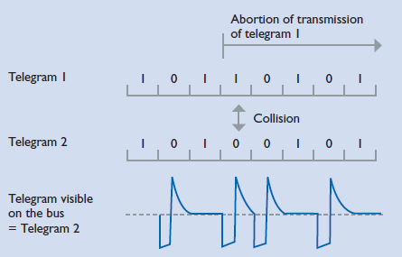

### KNX Powerline \(PL\)

* Using the existing electricity cables in a building as the KNX communication medium is a **cost-effective** way of retrofitting a building with KNX.
* The data signals are **superimposed** onto the mains voltage.
* KNX PL telegrams are essentially **extended KNX TP** telegrams.

#### Telegram structure

* **Training field**: synchronises and sets the **levels of senders and receivers**.
* **Preamble fields**: indicate the **start** of transmission, **control access** to the bus, and are needed to prevent telegrams from **colliding**.
* The third field contains the **KNX TP telegram**.
* **System ID field**: contains an ID for keeping the signals of different KNX PL systems **separate**, so that only devices using the same system ID can communicate with one another.

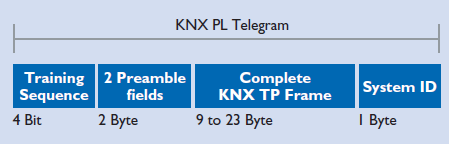

### KNX Radio Frequency \(RF\)

* Radio is always an appropriate KNX communication medium in those situations where it is **not possible to lay new cables** in the building \(e.g. for sensors in inaccessible areas\).
* KNX RF is also particularly suitable for **extending existing KNX TP installations**.

#### Telegram structure

* KNX RF telegrams are made up of several **data blocks** separated by **checksum \(CRC\)** fields.
* **Data blocks**: contain the actual **payload** as well as bus-specific information for addressing purposes.

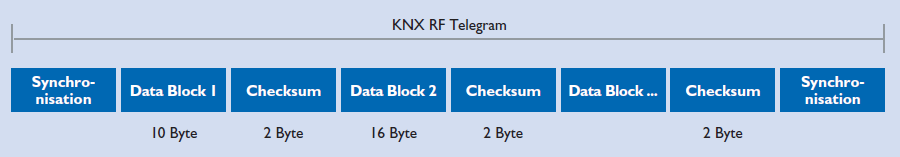

* The first data block
  * **Control field**: contains information about the **length** of the telegram, the **transmission quality**, the **battery status** of battery-operated KNX RF devices, and whether the device is **unidirectional**.
  * **Serial Number/Domain Address**: \(in **E-Mode**,\) the serial number is **evaluated** in the receiver together with the source address of the sender; \(in **S-Mode**,\) the domain address serves to keep neighbouring RF systems **separate** from one another.
  * **Checksum**: allows the receiver to determine whether or not a telegram has been **sent without error**.
* The second data block
  * **Individual Source Address**: physical address.
  * **Individual Destination Address or Group Address**
  * **Payload:** the actual information that is to be sent.

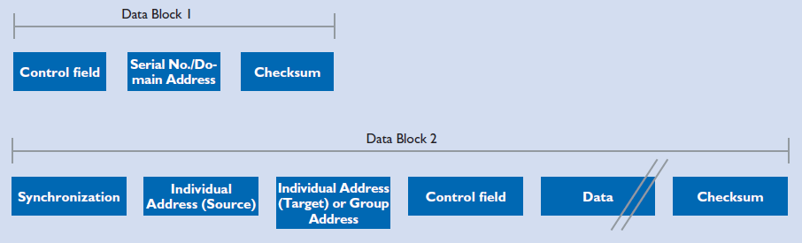

### KNX IP

* The existing network infrastructure in the building can be used for the **KNX main and backbone lines**.
* Buildings can be **monitored and controlled** via Ethernet from **anywhere** in the world.
* KNX customer installations can be **analysed and programmed remotely** over the internet.
* The KNX system uses two Ethernet communication methods – **KNXnet/IP tunneling** and **KNXnet/IP routing** – both of which use the **UDP protocol**.
* **Tunneling** is used to access the bus from a local network or the internet for purposes of e.g. **programming the KNX installation**.
* **Routing** is used for exchanging telegrams over an Ethernet network, e.g. to **couple two KNX TP systems** via Ethernet.

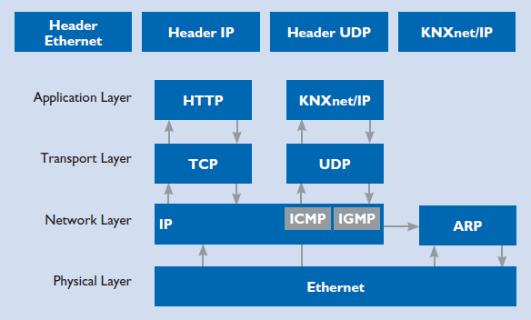

#### Telegram structure

* **Header Length**: is always the same and may change in a later version of the protocol.
* **Protocol Version**: indicates the version of the KNXnet/IP protocol.
* **Service Type Identifier**: indicates the **action that is to be carried out**.
* **Total Length**: indicates the total length of the KNXnet/IP telegram.
* **KNXnet/IP-Body**: contains the **payload**.

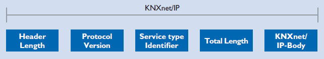

#### KNXnet/IP tunneling

* Tunneling is needed where **ETS is to be used to send KNX telegrams** in a connection-oriented manner within an IP framework.
* Communication always takes place via the **IP address of the KNXnet/ IP device** that is being used for tunneling.

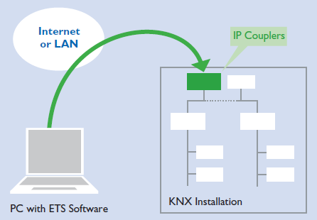

#### KNXnet/IP routing

* Routing is needed for the **simultaneous, connectionless transmission of KNX telegrams to several participants** via a KNXnet/IP router. \(group communication\)
* Routing is used for e.g. **coupling TP cables**.
* A KNXnet/IP router serving as a **line coupler for a KNX TP cable** will only send a telegram **to the IP side** if the corresponding group address appears in the **filter table** of the KNXnet/IP router.
* All other KNXnet/IP routers serving as **line couplers for other KNX TP lines** will only transmit the telegram from the IP side **to their KNX TP line** provided that the relevant group address appears in the **filter tables** of the KNXnet/IP routers.

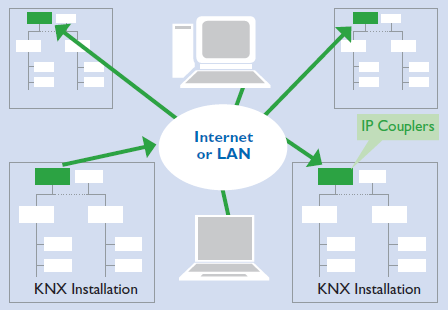

#### KNX IP and KNX TP compared

* Will the popularity of Ethernet eclipse that of the current most popular, established KNX medium, TP? - **NO**.
  * substantial **cabling costs**
  * **time-consuming** in networking
  * high **energy consumption**
* **Ethernet** will become increasingly established as a **high-performance backbone** and a means of **connecting complex \(KNX IP\) devices** in the hierarchical topology.

## KNX topology

### KNX TP

* The basic unit of a KNX TP installation is a line, including a KNX **power supply and choke**, and usually **no more than 64** other bus devices.

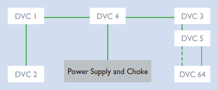

* **Line Repeaters** can be used to extend a line if more than 64 devices are needed. 
* Line repeaters **count as bus devices** in the line. 
* **No more than three** repeaters can be operated in parallel in a line, meaning the maximum number of bus devices is **255**.

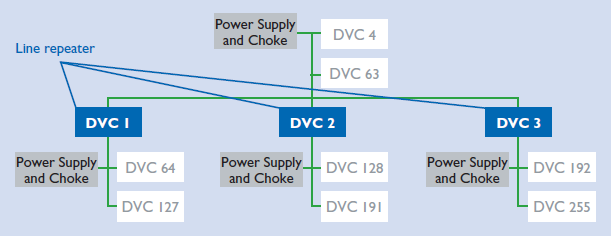

* Another way of expanding the installation is to create new lines using **Line Couplers**.
* A Line Coupler will not send a telegram to a line for which it is not destined. It **reduces the number of telegrams travelling along each line** \(by taking advantage of the **filter** function of the line couplers\).
* Line Couplers in the main line **count as bus devices**.
* **Up to 15 lines** can be operated on the **main line** via **Line Couplers** to form an **area**.
* The main line can accommodate **up to 64** devices.

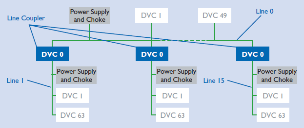

* **Up to 15 areas** can be added to an **area line** via **Area Couplers** to form a complete **system**.
* The area line \(also called the **backbone**\) can accommodate **up to 64** bus devices.

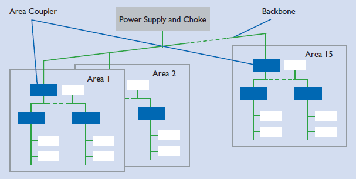

#### Individual Addresses

* Every device in a KNX system is assigned a unique, unambiguous number – its Individual Address.
* This consists of **three numbers separated by dots**.
* The **first** number denotes the number of the **area**.
* The **second** number denotes the number of the **line**.
* The **third** number is a sequential number indicating the device’s **position** in the line.
* **Area/Line Couplers** must always be given the number **0 as their sequential number**.
* Example:
  * Physical address 1.1.0: line coupler coupling the first line with the main line in the first area.
  * Physical address 2.3.20: bus device 20 in the third line of the second area.

### KNX PL

* The basic unit of an installation is a line containing a maximum of **255** devices.
* An **area** is created by coupling **15** KNX PL lines **using KNX TP**.
* The maximum number of areas is **eight** in KNX PL.
* Instead of line couplers, in KNX PL **System Couplers** \(also having **filter** function\) are used.

#### Individual Addresses

* **System couplers** \(like Area and Line Couplers\) are assigned **the sequential number 0**.
* Example:
  * Individual Address 1.5.0: system coupler coupling the fifth PL line with the **TP** main line in the first area.
  * Individual Address 2.3.20: PL bus device with sequential number 20 in the third line of the second area.

### KNX RF

* It needs to be ensured that **neighbouring** KNX RF installations cannot **interfere** with one another.
* Telegrams sent by KNX radio transmitters always include the **serial number/domain address of the device as a unique identifier**. Only those receivers paired with the transmitter are able to process telegrams sent by it.
* **Media Couplers** are used for coupling purposes.

#### Individual Addresses

* **Media couplers** are assigned physical addresses corresponding to their position in the system topology.
* Example:
  * Physical address 2.3.20: media coupler with sequential number 20 in the third line of the second area.

### KNX IP

* A **KNXnet/IP router** \(with an Ethernet port and a KNX TP Connection\) is used both as Line Couplers and Area Couplers in KNX IP.
* The routers are able to **filter** telegrams and  **forward** KNX telegrams to other KNXnet/IP routers using the routing method.
* Most KNXnet/IP routers also support **tunneling**, i.e. they can also be used as an **IP programming interface for ETS**.

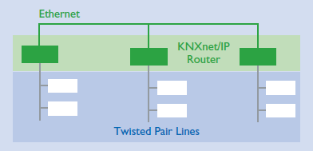

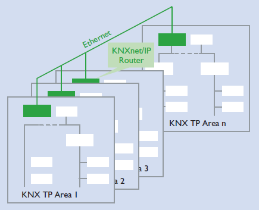

* KNXnet/IP routers can additionally be used to **connect entire separate systems with one another via Ethernet**.
* KNX IP can also be used to **network KNX devices**, e.g. KNX displays, with one another.

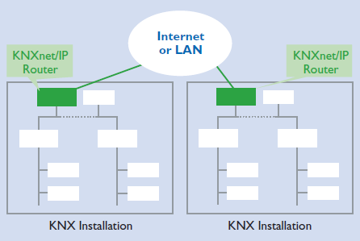

#### Individual Addresses

* KNXnet/IP routers \(**routing**\) are given the sequential number **0**.
* KNX IP interfaces \(**tunneling**\) can be given **any** sequential number.
* Example:
  * Individual Address 1.5.0: KNXnet/IP router acting as a line coupler, coupling the fifth line with the main line in the first area.
  * Individual Address 2.3.20: KNX IP programming interface with sequential number 20 in the third line of the second area.

### Mixed topology

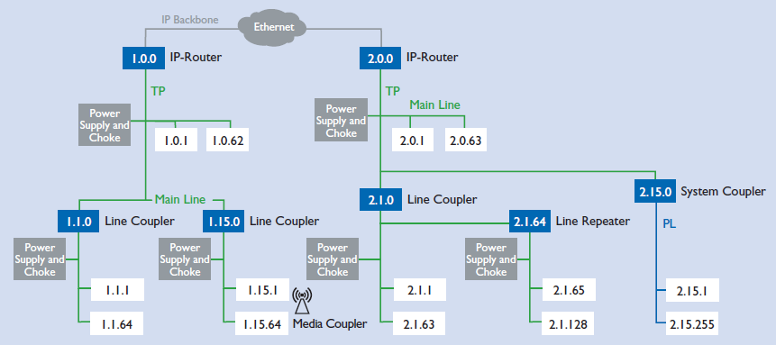

## References

* [KNX Basics](https://www.ivoryegg.co.uk/site_files/29_KNX-Basics_en.pdf)
* [KNX Basics](https://www.knx.org/wAssets/docs/downloads/Marketing/Flyers/KNX-Basics/KNX-Basics_en.pdf)

