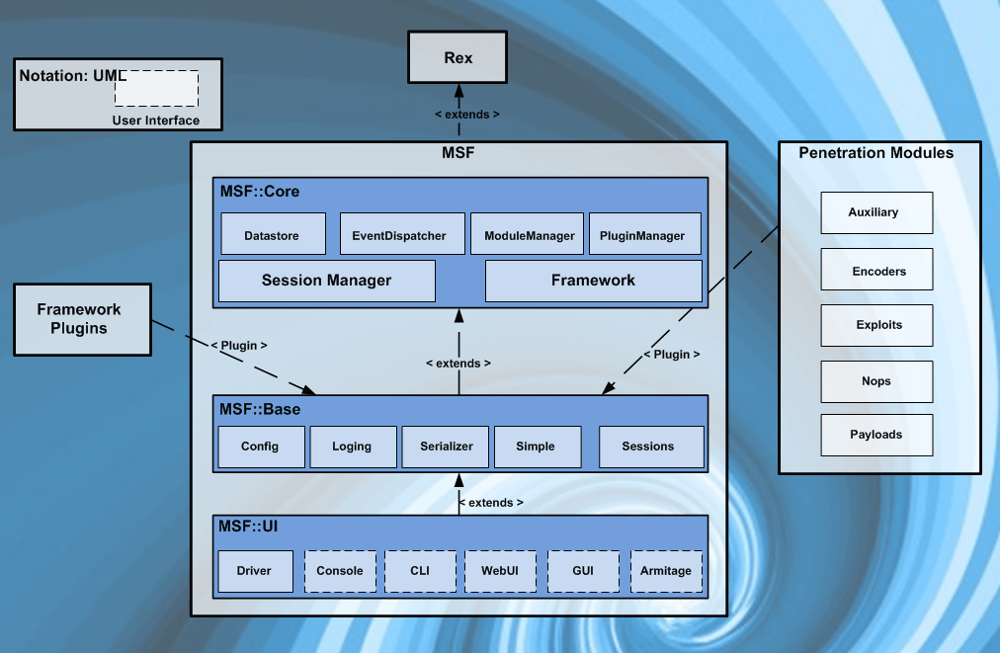

# Metasploit Object Model

* In the Metasploit Framework, all modules are **Ruby** classes.
* Modules inherit from the **type-specific class**.
* The type-specific class inherits from the **Msf::Module class**.
* There is a **shared common API** between modules.
* Payloads are slightly different.
  * Payloads are **created at runtime** from various components.
  * Glue together **stagers** with **stages**.

## References



